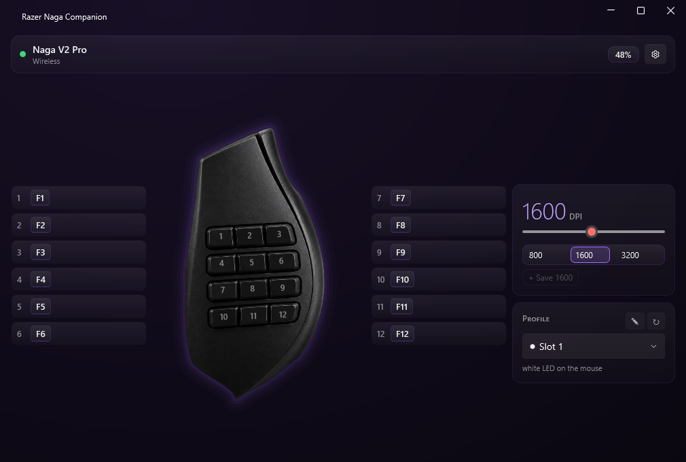
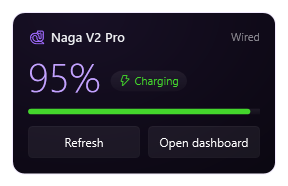
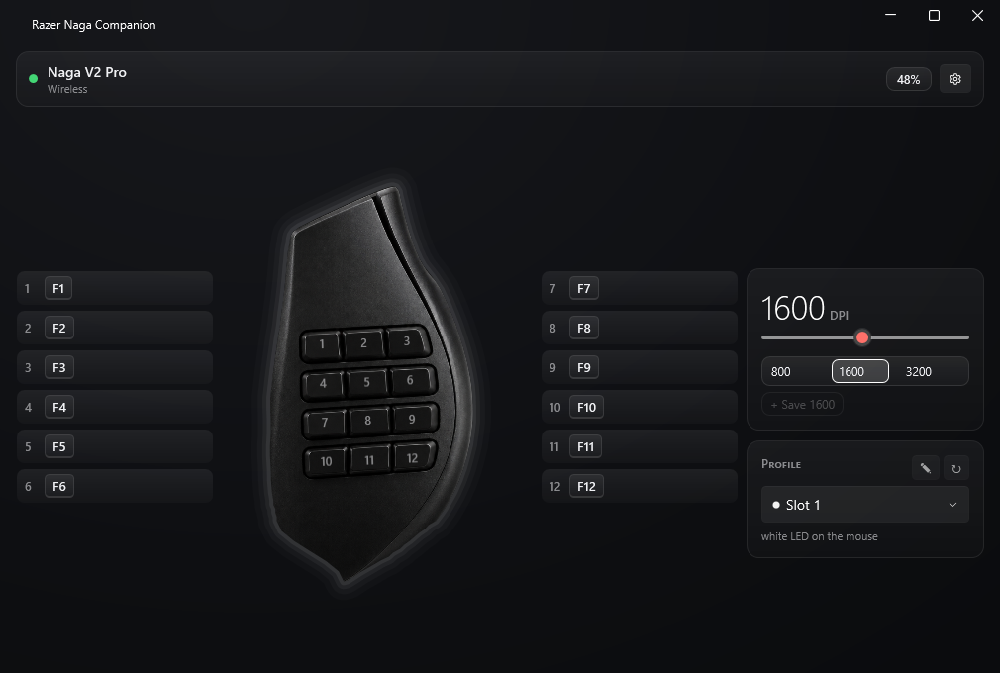
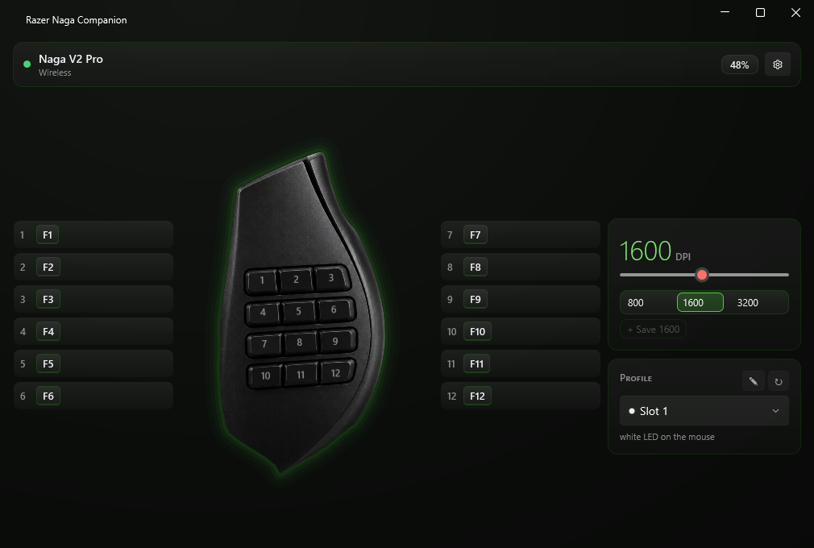
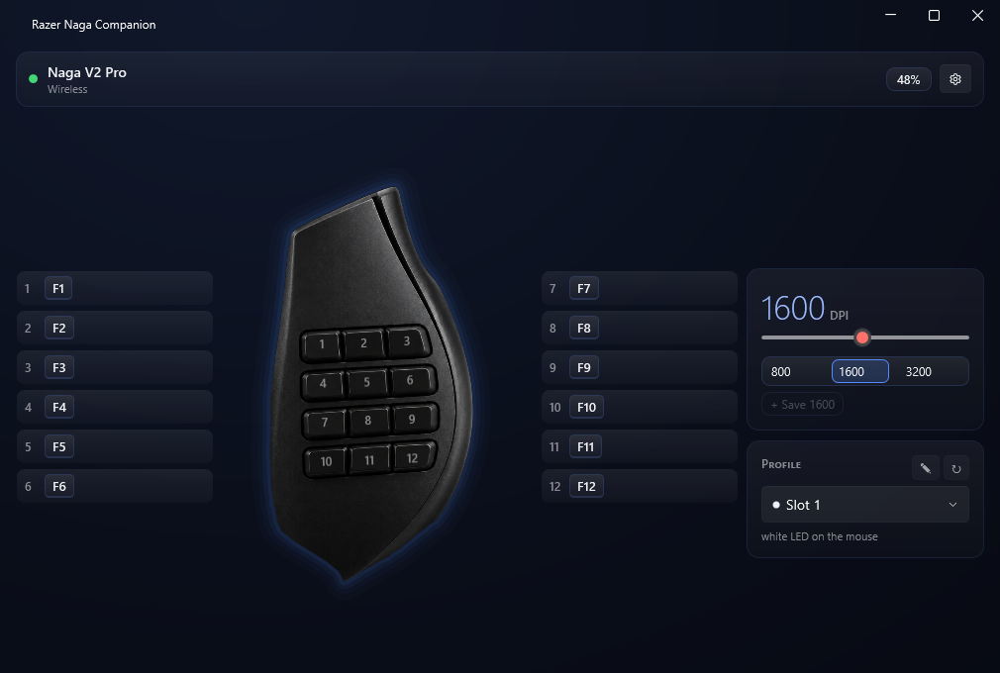
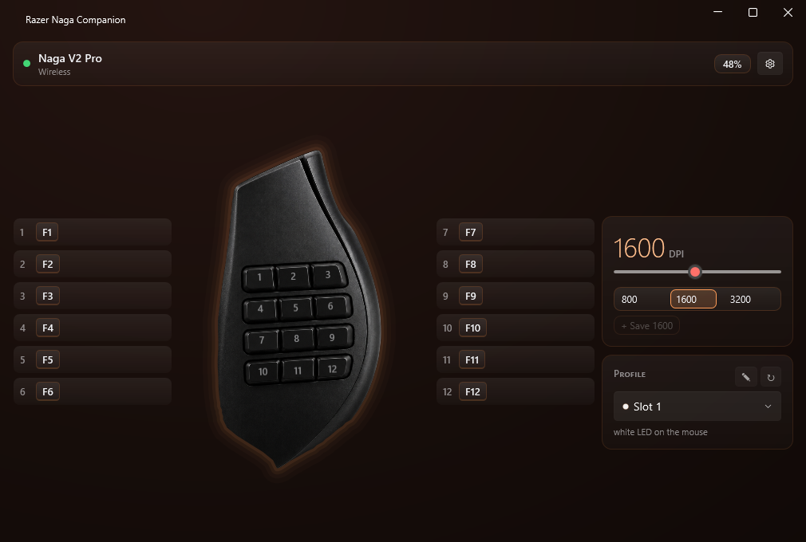
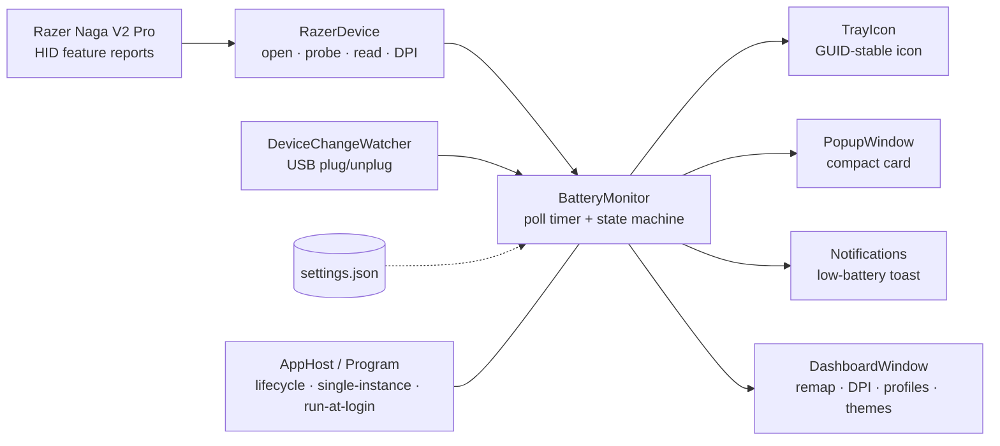

<div align="center">

# 🐍 Razer Naga Companion

### Your Razer Naga V2 Pro battery, right in the system tray — **no Razer Synapse required.**

[](https://www.microsoft.com/windows)
[](https://dotnet.microsoft.com/)
[](#why)
[](#-footprint)
[](#-footprint)
[](LICENSE)

<br/>



</div>

---

## Why?

Razer Synapse is **hundreds of megabytes** and several always-running background
services just to tell you your mouse's battery level. Razer Naga Companion does that
**one job** — and does it in **~23 MB of RAM at 0% idle CPU**, reading the mouse
directly over HID with no Synapse, no driver, and no admin rights.

> Built for the **Razer Naga V2 Pro** (wireless). Other Razer mice may work if they
> speak the same HID battery protocol, but only the Naga V2 Pro is verified.

---

## ✨ Features

- 🔋 **Battery % in the tray** — a round gauge that stays sharp at any display scaling
  (100%/150%/200%): white digits on a dark coin whose rim ring carries the level color
  (🟢 green → 🟡 amber → 🔴 red, green while charging), switchable between a round gauge
  and classic big digits.
- 🖱️ **Click for details** — a compact popup with the exact %, a charging chip, a level
  bar, the active link (Wired / Wireless / On battery), and Refresh + Open dashboard.
- 🎨 **Themed dashboard** — one window for everything: the thumb panel rendered photo-real
  with the 12 grid buttons overlaid for remapping, DPI and Profile cards, a settings
  overlay (low-battery threshold, poll cadence, reset-all-buttons), and five built-in
  themes (Porcelain, Razer, Ice, Ultraviolet, Ember) that repaint the whole UI live.
- 🎯 **DPI control** — read and set the mouse's hardware DPI with a log-scale slider, a
  segmented preset row (default 800/1600/3200 — add/remove your own), or by **typing it**:
  click the big readout, enter a value, and Enter applies it to the device and saves it as
  a preset. Failed writes are surfaced, never silent. No Synapse round-trip.
- ⌨️ **Button remapping** — click a thumb-grid button, press a key (with Ctrl/Shift/Alt/Win
  modifiers), or hit Disable — it applies instantly to the mouse's **onboard memory**, with
  a 5-second undo that restores the previous binding byte-for-byte (even Synapse macros the
  app can't model). The grid always shows what's really on the mouse: it reads the active
  onboard slot back from the hardware. Bindings survive power-cycles and reboots with **no
  software running at all**.
- 🗂️ **Onboard profile switching** — see and switch the mouse's active onboard slot (1–5)
  from the dashboard, with each slot's LED colour and your own rename labels. *(The
  active-slot read/set protocol isn't in openrazer or any public reference — it was found
  by this project's own hardware probe sweep.)*
- 🔔 **Low-battery toast** — a native Windows notification when you drop to/below your
  threshold (default 15%) while on battery.
- ⚡ **Charging aware** — polls faster while charging (15 s vs 60 s), suppresses nagging
  notifications, and flips charge status **instantly** when you plug/unplug the cable.
- 🔗 **Wired & wireless** — reads battery over the USB-C cable as well as the dongle, and
  shows which link is active.
- 🪶 **Featherweight** — single background process, ~0 idle CPU, ~23 MB private RAM.
- 🔌 **No Synapse** — talks to the mouse directly via HID feature reports.
- 🚀 **Runs at login**, single-instance, fully per-user (no UAC / admin prompt ever).

---

## 👀 What it looks like

The tray shows a battery coin gauge (or classic digits) recolored by level — click it for
the popup:

<p align="center">
  
</p>

**Five themes, one click** — every color in the UI repaints live:

<p align="center">
  
  
  
  
</p>

*(Screenshots are rendered straight from the real windows by the repo's UI probe — set
`NAGA_UI_PROBE=1` and run `dotnet test --filter DashboardScreenshotProbe` — so they can't
drift from the code.)*

---

## 📊 Footprint

Measured on the installed build, sitting idle in the tray:

| Metric | Value |
| --- | --- |
| **Idle CPU** | **0 %** |
| **Private working set** (real RAM cost) | **~23 MB** |
| Full working set | ~90 MB *(mostly shared runtime pages Windows reclaims)* |
| Poll cadence | 60 s on battery · 15 s while charging |
| On-disk install | ~196 MB *(bundles the .NET 10 runtime — see [below](#a-note-on-size))* |

---

## 🚀 Install

**Prerequisite:** the [.NET 10 SDK](https://dotnet.microsoft.com/download) to build it.
A per-user SDK install works fine — **no admin required**.

```powershell
git clone https://github.com/Bmwascher/razer-naga-companion.git
cd razer-naga-companion
.\scripts\install.ps1
```

`install.ps1` publishes a Release build, copies it to
`%LOCALAPPDATA%\Programs\NagaBatteryTray\`, registers it to **run at login**, and
launches it. Re-run it any time to update after pulling new code.

### Run at login

`install.ps1` wires this up automatically (a per-user logon **scheduled task** with a
1-minute delay — not the `HKCU\…\Run` key, which fires too early in boot for Smart App
Control to clear an unsigned binary). You can also toggle it from the tray icon's
right-click menu → **Run at startup**.

### 🔄 Update

```powershell
git pull
.\scripts\install.ps1
```

### 🗑️ Uninstall

```powershell
.\scripts\uninstall.ps1
```

Stops the app, removes the run-at-login entry, and deletes the install folder. Your
settings at `%APPDATA%\NagaBatteryTray\settings.json` are left in place — delete that
folder too for a clean wipe.

---

## 🩺 Diagnostics

If the battery never shows up (mouse asleep, different firmware, etc.), run the built-in
HID probe — it enumerates the Razer HID collections, tries each known transaction id, and
prints the raw battery reply:

```powershell
& "$env:LOCALAPPDATA\Programs\NagaBatteryTray\NagaBatteryTray.exe" --probe          # battery
& "$env:LOCALAPPDATA\Programs\NagaBatteryTray\NagaBatteryTray.exe" --probe-dpi      # active DPI
& "$env:LOCALAPPDATA\Programs\NagaBatteryTray\NagaBatteryTray.exe" --probe-buttons  # remap protocol
& "$env:LOCALAPPDATA\Programs\NagaBatteryTray\NagaBatteryTray.exe" --probe-profile  # onboard slots
& "$env:LOCALAPPDATA\Programs\NagaBatteryTray\NagaBatteryTray.exe" --probe-dock     # Mouse Dock Pro
```

---

## 🧠 How it works



- **`Hid/RazerProtocol.cs`** — pure protocol: builds the 90-byte feature report, computes
  the XOR CRC, parses replies. Battery = class `0x07` / id `0x80` (value at reply byte 9,
  scaled `× 100 / 255`); DPI = class `0x04`; button bindings = class `0x02`; onboard
  profiles (list / active-slot get & set) = class `0x05`. All hardware-verified against the
  real mouse.
- **`Hid/RazerDevice.cs`** — opens the mouse's HID collection with zero-access
  `CreateFile` + `HidD_SetFeature` / `HidD_GetFeature` (the feature report lives on the
  OS-owned mouse collection, which a normal HID stream can't open), probes transaction
  ids and caches the one that works, picks whichever interface is live (wired or wireless),
  and reads/writes the active DPI.
- **`Monitoring/BatteryMonitor.cs`** — polling timer + state machine (online/unknown,
  low-battery edge logic, staleness → unknown); also the DPI and button read/set
  pass-throughs (everything shares one lock — never two concurrent device exchanges).
- **`Ui/`** — `IconRenderer` (GDI+ number icon, DPI-aware, supersampled, with a
  battery-level ring), `TrayIcon` + `TrayIconController` (Win32 `Shell_NotifyIcon` with a
  stable GUID so the taskbar position survives restarts), `PopupWindow` (compact WPF card,
  multi-monitor placement), `Dashboard/` (`DashboardWindow` — instant-apply remap chips on
  a photo-real mouse stage, a DPI card with segmented presets + type-in readout, a Profile
  card with slot switching/renaming, a settings overlay), `Themes/` (5 preset themes
  swapped at runtime by `ThemeManager`), `DeviceChangeWatcher` (instant refresh on USB
  plug/unplug), `Notifications` (toast).
- **`AppHost.cs` / `Program.cs`** — single-instance mutex, lifecycle wiring, and refresh
  on power-resume / session-unlock / USB device-change.

Full design and implementation notes live in [`docs/superpowers/`](docs/superpowers/).

---

## 🗺️ Roadmap

- [x] **v1 — Battery tray**: tray %, popup, low-battery toast, charging detection,
      run-at-login.
- [x] **Settings + active DPI**: a real Settings window for threshold and poll cadence,
      plus reading and setting the mouse's hardware DPI on the device.
- [x] **Reliability & polish**: wired/USB-C battery, instant charge-status on plug/unplug,
      GUID tray icon (taskbar position persists), larger tray digits, refreshed popup.
- [—] **C — Dock charger support**: *closed — the Mouse Dock Pro relay is non-viable on
      this firmware (it never answers a battery query). Charging while docked already shows
      via the mouse's own read.*
- [x] **B — Button remapping**: bind each thumb-grid button to a key (+modifiers) or disable
      it, written straight into the mouse's onboard memory — survives power-cycles with no
      software running. *(The V2 Pro's remap protocol wasn't publicly documented; a hardware
      spike captured it — grid ids `0x40..0x4b`, command `0x02/0x0c` — see
      [`docs/superpowers/`](docs/superpowers/).)* Since v2.3 the grid shows **hardware truth**:
      it reads the active onboard slot back and edits any slot in place, protected by a
      byte-for-byte snapshot + raw undo.
- [x] **GUI redesign**: the old Settings window is gone — a themed dashboard (5 built-in
      themes: Porcelain, Razer, Ice, Ultraviolet, Ember) replaces it with a photo-real mouse
      stage for instant-apply button remapping (capture + 5 s undo), DPI presets, a Profile
      card, and a tray battery-level ring. See [`docs/superpowers/`](docs/superpowers/).
- [x] **Onboard profile switching**: the Profile card reads and sets the mouse's active
      slot (LED-colour dots, app-side rename labels). *(Class `0x05` get `0x84` / set `0x04`,
      persists across power-cycles — found by this project's own opt-in probe sweep; not in
      openrazer or any reference repo.)*
- [x] **Dashboard polish**: slot renaming, a segmented DPI preset control with a
      click-to-type readout, failed-apply surfacing, and an off-screen screenshot probe for
      iterating on layout without installing.
- [ ] **DPI stages + polling rate**: program the onboard 5-stage DPI table (+ stage
      up/down) and the polling rate — the preset row likely becomes the onboard stage table.
- [ ] **Lighting**: thumb-grid / scroll-wheel zone effects + brightness, theme-sync
      candidate.

---

## 🛠️ Building from source

```powershell
dotnet build                                   # Debug (framework-dependent, fast inner loop)
dotnet test                                    # run the xUnit suite
dotnet publish src/NagaBatteryTray -c Release  # full self-contained single-file exe
```

#### A note on size

The Release build is **self-contained**: it bundles its own copy of the .NET 10 runtime,
so the installed app depends on nothing being installed on the machine and keeps working
through any future .NET changes. That's the ~196 MB on disk — but the *private* RAM cost
is still only ~23 MB.

> ⚠️ The publish output is one ~188 MB `NagaBatteryTray.exe` **plus five small
> `*_cor3.dll` WPF native libraries**. Those DLLs must stay next to the exe — WPF loads
> them natively, and single-file publishing leaves them beside the exe by design. (The
> install script handles this; copying the exe alone crashes with `DllNotFoundException`.)

---

## 🧪 Tech stack

C# · .NET 10 (`net10.0-windows`) · WPF + WinForms · Win32 `Shell_NotifyIcon` (GUID tray) ·
HidSharp · [WPF-UI](https://github.com/lepoco/wpfui) (Fluent styling) ·
CommunityToolkit.WinUI.Notifications · xUnit.

---

## ⚠️ Disclaimer

This is an independent, community project. It is **not affiliated with, endorsed by, or
sponsored by Razer Inc.** "Razer" and "Naga" are trademarks of Razer Inc., used here only
to describe hardware compatibility. Use at your own risk.

---

## 📄 License

[MIT](LICENSE) © Brandon Wascher
